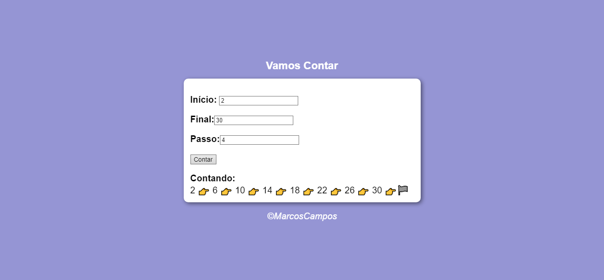

# Super-Contador
Exercício / Módulo D  
<b> -Curso em Vídeo-</b>
 
Dado o Valor:
  <ul>
     <li><b>Inicial</b></li>
     <li><b>Final</b></li>
     <li><b>Passos</b></li>
  </ul> 
Resultando em sua ordem, tanto:
  <ul>
     <li><b>Crescente</b></li>
     <li><b>Decrescente</b></li>
  </ul>

